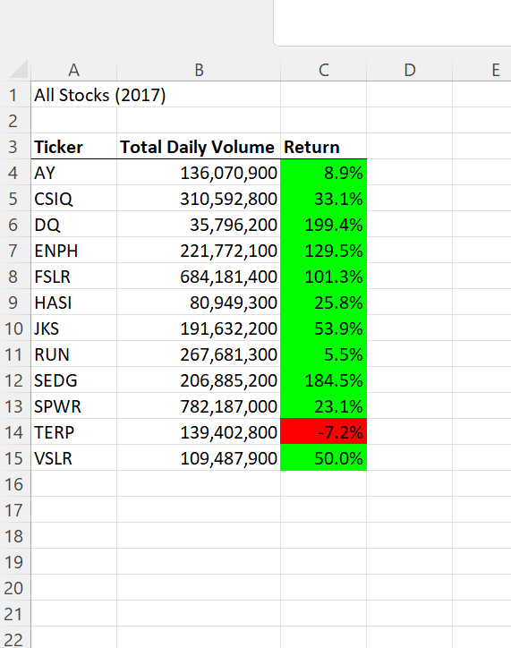
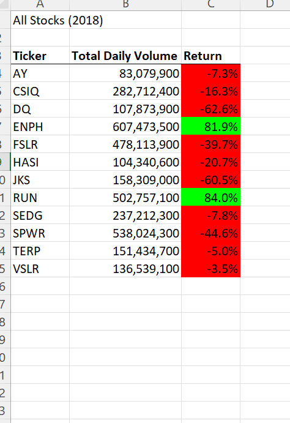

# Green-Stock-Analysis

## Project Overview
 
 ###  Background
 
Steve wants to help his parents and analyze a group of 12 green stocks , so he can support nad provide better answer for his parent's investment decisions. So Steve asked me a favor to help him out and made a workbook and to create a flexible macro for running multiple stock, so he can analyze the dataset. In order to do so, I  need to design a workbookk using Visual Basic Application (VBA) within Excel to provid each stocks annual volume and yearly return on investment for each stock.
  
Steve loves the workbook that I prepared for him. At the click of a button, he can analyze each stock and he can expand hi research as well.

### Purpose

Steve wants to analyze which stocks give a higher yearly return. if I run the code for each individual stocks , it may take extra time but it will give us results.  NOe i take the advantage of the refractored code of VBA, I will improve the workbook efficiency, only clicking by one button. I will also going to find outthe execution time for each year analysis.

## Results

To make code more efficient, I created 3 new arrays : tickerVolumes(12) to hold volume of 12 green stocks, tickerStartinPrices(!2) to hold the starting rice, which was paid initially in order to buy the stocks, and tickerEndingPrices(12) to hold ending price of each 12 green stocks.

The above 3 arrays create the performace data for wach 12 stocks whenever a for Loop runs analysis on them. These 3 performance arrays with the ticker array is done by using variable , which is called tickerIndex.

Now I can us Nested Loops  and variabls to loop through the data and complete the analysis.

Here's the edited Refractored code that I used to complete my analysis.

_Sub AllStocksAnalysisRefactored()
    Dim startTime As Single
    Dim endTime  As Single

    yearValue = InputBox("What year would you like to run the analysis on?")

    startTime = Timer
    
    'Format the output sheet on All Stocks Analysis worksheet
    Worksheets("All Stocks Analysis").Activate
    
    Range("A1").Value = "All Stocks (" + yearValue + ")"
    
    'Create a header row
    Cells(3, 1).Value = "Ticker"
    Cells(3, 2).Value = "Total Daily Volume"
    Cells(3, 3).Value = "Return"

    'Initialize array of all tickers
    Dim tickers(12) As String
    
    tickers(0) = "AY"
    tickers(1) = "CSIQ"
    tickers(2) = "DQ"
    tickers(3) = "ENPH"
    tickers(4) = "FSLR"
    tickers(5) = "HASI"
    tickers(6) = "JKS"
    tickers(7) = "RUN"
    tickers(8) = "SEDG"
    tickers(9) = "SPWR"
    tickers(10) = "TERP"
    tickers(11) = "VSLR"
    
    'Activate data worksheet
    Worksheets(yearValue).Activate
    
    'Get the number of rows to loop over
    RowCount = Cells(Rows.Count, "A").End(xlUp).Row
    
    '1a) Create a ticker Index
     tickerIndex = 0
    

    '1b) Create three output arrays
       Dim tickerVolumes(12) As Long
       Dim tickerStartingPrices(12) As Single
       Dim tickerEndingPrices(12) As Single
              
    
    
    ''2a) Create a for loop to initialize the tickerVolumes to zero.
       For i = 0 To 11
       
       tickerVolumes(i) = 0
       
       Next i
        
    ''2b) Loop over all the rows in the spreadsheet.
    For i = 2 To RowCount
    
        '3a) Increase volume for current ticker
          
          tickerVolumes(tickerIndex) = tickerVolumes(tickerIndex) + Cells(i, 8).Value
        
        '3b) Check if the current row is the first row with the selected tickerIndex.
        'If  Then
            
            If Cells(i, 1).Value = tickers(tickerIndex) And Cells(i - 1, 1).Value <> tickers(tickerIndex) Then
            
            tickerStartingPrices(tickerIndex) = Cells(i, 6).Value
            
            End If
            
                
        '3c) check if the current row is the last row with the selected ticker
         'If the next row’s ticker doesn’t match, increase the tickerIndex.
        'If  Then
             
            If Cells(i, 1).Value = tickers(tickerIndex) And Cells(i + 1, 1).Value <> tickers(tickerIndex) Then

            tickerEndingPrices(tickerIndex) = Cells(i, 6).Value
            
            End If

            '3d Increase the tickerIndex.
            
            If Cells(i, 1).Value = tickers(tickerIndex) And Cells(i + 1, 1).Value <> tickers(tickerIndex) Then
            
            tickerIndex = tickerIndex + 1
            
           End If
                      
        
       
   Next i
    
    '4) Loop through your arrays to output the Ticker, Total Daily Volume, and Return.
    
    For i = 0 To 11
        
        Worksheets("All Stocks Analysis").Activate
        
        
        Cells(4 + i, 1).Value = tickers(i)
        Cells(4 + i, 2).Value = tickerVolumes(i)
        Cells(4 + i, 3).Value = tickerEndingPrices(i) / tickerStartingPrices(i) - 1
        
    Next i
    
    'Formatting
    Worksheets("All Stocks Analysis").Activate
    Range("A3:C3").Font.FontStyle = "Bold"
    Range("A3:C3").Borders(xlEdgeBottom).LineStyle = xlContinuous
    Range("B4:B15").NumberFormat = "#,##0"
    Range("C4:C15").NumberFormat = "0.0%"
    Columns("B").AutoFit

    dataRowStart = 4
    dataRowEnd = 15

    For i = dataRowStart To dataRowEnd
        
        If Cells(i, 3) > 0 Then
            
            Cells(i, 3).Interior.Color = vbGreen
            
        Else
        
            Cells(i, 3).Interior.Color = vbRed
            
        End If
        
    Next i
 
    endTime = Timer
    MsgBox "This code ran in " & (endTime - startTime) & " seconds for the year " & (yearValue)

End Sub

## 2017 vs 2018 Stock Performance

After running the code, there is vast difference between 2017 stock performance and 2018 stock performance. Only 2 stocks ENPH  and RUN produced a positive yearly returns in both years. 

 
 
 
